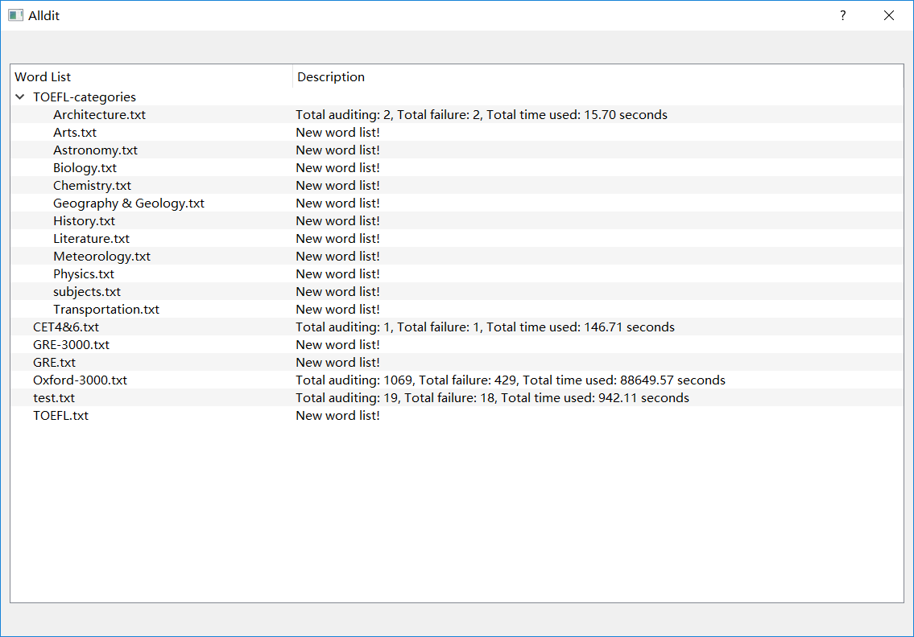
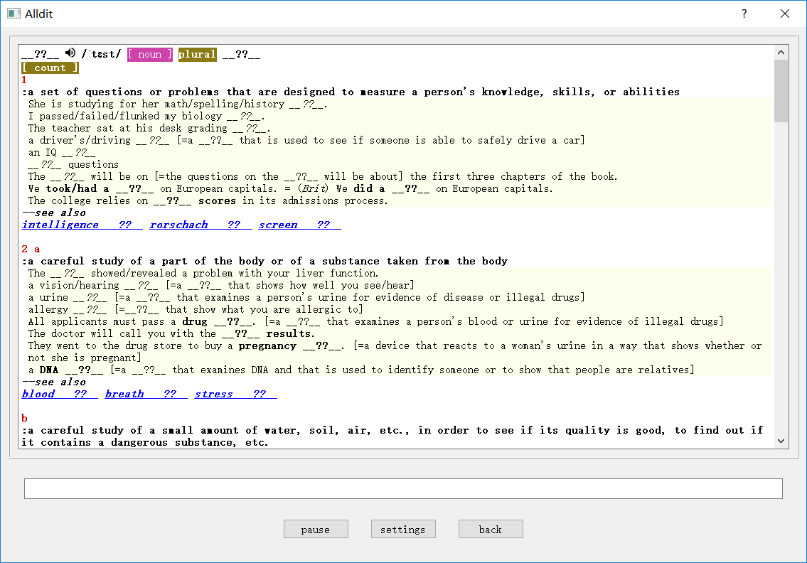
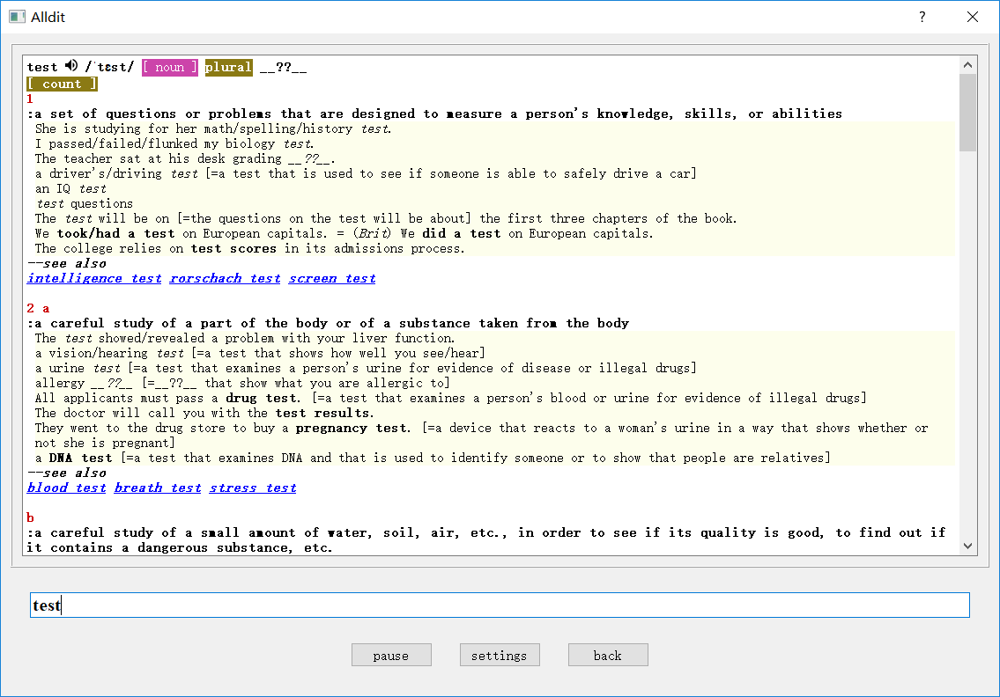

<h1 align="center">全听全写</h1>

全英文环境的听写教练！全面夯实英语基础！

支持库: Merriam Webster dictionary API &amp; PyQt5 & MongoDB

[English](./README.md) | 简体中文

## ✨ 亮点
- 📗 高质量免费Merriam Webster Learner's 词典API，特别适合入门者
- 🥪 单词是由拼写、发音和意思共同构成的，在听写中你可以在全英语环境中同时练习这些技能，无需像背单词一样，将单词和汉语意思练习起来
- ⚙️ 非常简单的自定义词汇列表功能
- 📈 全面的统计信息，帮助你规划学习进度
- 👀 漂亮的界面，保护你的眼睛
- 🔌 代码简短易懂，非常方便扩展功能

## 🖥 支持环境
- Windows
- Linux & BSD
- MacOS

## 📦 安装
- 在你的操作系统上安装 MongoDB服务器、git、Python 3 和 pip 3，然后
```bash
git clone https://github.com/laviva-cs/Alldit
cd Alldit
pip3 install PyQt5 pymongo pygame
python3 ./main.py
```

## 🔨 使用
成功运行后，初始界面如下图：
<p align="center">

</p>

单词列表在*lists/*目录下，你可以任意添加自己的单词表。所有的单词表都是同等的。除了*TOEFL-categories/* and *show/*目录下的。这两个目录下的单词表不会隐藏单词，只是15秒循环播放。

统计信息在本地的MongoDB存储。初始界面显示统计概况。

双击一个列表名称，你会进入听写环境。问题的形式是显示词典的相关词条但隐藏当前单词。你可能也注意到，单词的复数形式和分词形式等变形也一并隐藏了。

<p align="center">

</p>
<p align="center" >  单词 "test" 及其复数形式 "tests" 都被隐藏了。 </p><br/>

回答问题的方式是输入隐藏的单词并按回车。你可以用空格分开不同的单词以批量回答单词及其变形。
- 正确回答的单词将会取消隐藏，未回答的单词仍被隐藏。
<p align="center">

</p>
<p align="center" >  在输入 "test" 并回车后, 其复数 "tests" 仍被隐藏。 </p><br/>

- 全部回答正确，则开始下一个单词的听写。
- 或者如果错误答案超过3个，隐藏的单词会显示成红色，听写者需继续输入所有的错误单词以开始下一个单词的听写。
<p align="center">

</p>
<p align="center" > 3 个错误导致所有的隐藏单词都被显示。 </p><br/>

音频每15秒播放一次，帮助你将发音和这个词联系起来，而不是和你偷偷写的汉语注音或者其它奇怪的东西联系起来。

😉 祝顺利！仍然在不断修复bug。报错请按下文与我交流 ⬇️

## 🤝 贡献代码
让我们一起把 Alldit 全听全写 做好！欢迎以 [pull requests](https://github.com/laviva-cs/Alldit/pulls) 和 [issues](https://github.com/laviva-cs/Alldit/issues) 的方式提交你的想法 :)

## 🔗 链接和引用
- [本页](https://github.com/laviva-cs/Alldit)
- [Merriam Webster Dictionary API](https://www.dictionaryapi.com/)
- [MongoDB](https://www.mongodb.com/)
- [PyMongo](https://api.mongodb.com/python/current/)
- [PyQt5](http://pyqt.sourceforge.net/Docs/PyQt5/)
- [参考词典API实现](https://github.com/pfeyz/merriam-webster-api)
- [pygame](https://www.pygame.org)
- [Yattag](http://www.yattag.org/)
- [Anki](https://ankiweb.net)